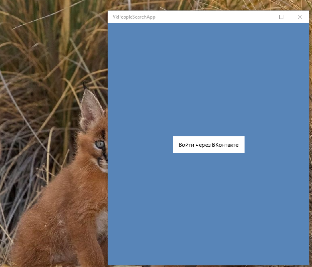

# VkPeopleSearchApp
A sample Windows 10 Mobile app for updated VkLib library. 

This is my mini-research of VK services (or, how to use VkLib...)

## About
The code based on VkLib by Stealth2012. 2 words about the original:
- A sample Windows Phone 8.1 (WinRT) app for VkLib library. Shows how to use VkLib to perform OAuth and to search users in VK.com.

## Screenshots
<table><tr>
<td>  </td>
</tr></table>

## Status
- Work-in-progress

## Credits
https://github.com/artemshuba/VkPeopleSearchApp -- Artem Shuba's VkPeopleSearchApp

AS IS. No support. RnD only.

-- mediaexplorer 2022

